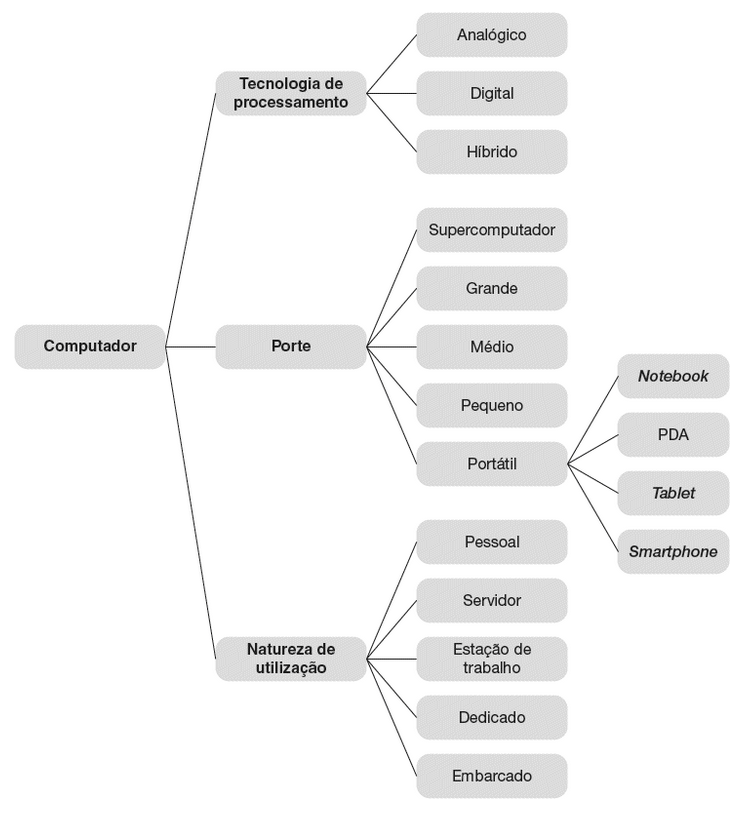

# Computação

## Área meio ou fim

* Computação como área-meio: suporte às outras áreas como Biologia, Engenharia, Física, Medicina, Sociologia, etc;
* Computação como área-fim: desenvolvimento ou aprimoramento de algoritmos, melhores arquiteturas de computadores, computação para grande volume de dados;

## Computação ou Informática

Processamento de Dados, Análise de Sistemas, Tecnologia da Informação, etc, são tratadas como sinônimos muitas vezes. Mas, os dois termos comuns são computação e informática.

* Computação: ato ou efeito de computar qualquer trabalho ou atividade que envolva o uso do computador;
* Informática: o estudo da computação e do processamento de informações que abranjam todos os aspectos relacionados com hardware e software;

A Computação/Informática é uma ciência e arte que tem por objetivo coletar, produzir, processar e analisar dados, produzindo informação, que pode gerar conhecimento.

## Tipos de Computadores

Classificados segundo:

* a tecnologia de processamento;
* o porte;
* a natureza de utilização.

### Tecnologia de Processamento

Os analógicos utilizam fenômenos físicos contínuos para realizar o processamento de dados, enquanto os digitais utilizam o sistema binário para processamento e armazenamento de dados.

### Porte de Computadores

O porte está relacionado ao peso, tamanho, recursos agregados e capacidade de processamento e armazenamento. São classificados como:

* computadores portáteis: notebooks, PDAs, smartphones, ...;
* computadores de pequeno porte: desktops;
* computadores de médio porte: servidores;
* computadores de grande porte: mainframes;
* supercomptadores.

### Função

Tipos ou funções:

* computador pessoal;
* computador servidor: mais recursos para disponibilizar serviços a outros computadores;
* estação de trabalho: maior processamento para aplicações específicas;
* computador dedicado: com hardware específico;
* computador embarcado: hardware e software específico embutido.

### Usos da Computação

Setores empresariais tais como:

* Agropecuária;
* Comércio;
* Construção Civil;
* Energia;
* Manufatura;
* Telecomunicações;

Setores não empresariais:

* Doméstico e Pessoal
* Saúde
* Pesquisa
* Segurança
* Ensino
* Administração Pública

## Componentes

* Software: conjunto de programas;
* Hardware: partes tangíveis;
* Dados: partes de informação armazenadas e em trânsito no hardware e processadas segundo o software.
